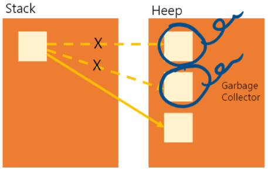

# 가비지 컬렉션(Garbage Collection)
가비지 컬렉션(Garbage Collection)은 자바의 메모리 관리 방법 중의 하나로 JVM(자바 가상 머신)의 Heap 영역에서 동적으로 할당했던 메모리 중 필요 없게 된 메모리 객체(garbage)를 모아 주기적으로 제거하는 프로세스를 말한다.

## 필요한 이유
- 메모리 누수 방지 : 프로그램이 실행되는 동안 메모리를 동적으로 할당하고 사용하지만 개발자가 명시적으로 메모리를 해제하지 않거나 잘못된 방법으로 해제하는 경우 메모리 누수가 발생할 수 있다. 가비지 컬렉션은 이러한 누수된 메모리를 탐지하여 해제함으로써 메모리 사용량을 최적화하고 누수를 방지한다.

- 편의성과 생산성 : 명시적인 메모리 관리는 복잡하고 오류가 발생할 수 있는 작업이지만 가비지 컬렉션은 개발자의 메모리 관리에 대한 부담을 덜 수 있고, 코드 작성과 유지보수에 대한 생산성을 향상시킬 수 있다.

## 기본적인 동작 메커니즘
- Reachability Analysis(도달성 분석): 가비지컬렉션은 주어진 시점에서 어떤 객체가 사용 가능한지 판단하기 위해 도달성 분석을 수행한다. 주요 객체를 시작으로 해당 객체가 참조하는 다른 객체들을 추적하여 어떤 객체들이 도달 가능한지를 결정한다.

- Garbage Detection(가비지 탐지): 도달성 분석을 통해 도달 가능하지 않은 객체들, 즉 가비지 객체들을 식별한다. 이러한 가비지 객체들은 해제되어 메모리를 회수할 수 있는 대상이다.

- Memory Reclamation(메모리 회수): 가비지 객체들의 메모리를 해제하여 재사용 가능한 메모리로 반환한다. 이 단계에서는 가비지 객체들을 실제로 메모리에서 제거하고, 해제된 메모리를 다시 사용 가능한 상태로 만든다.

